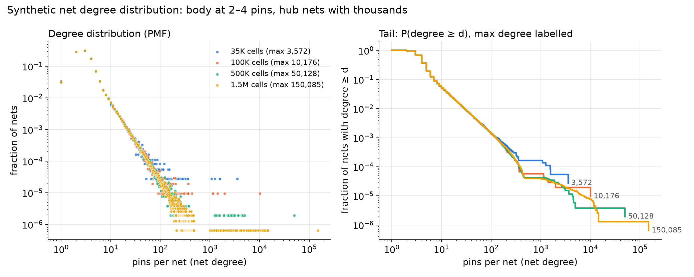
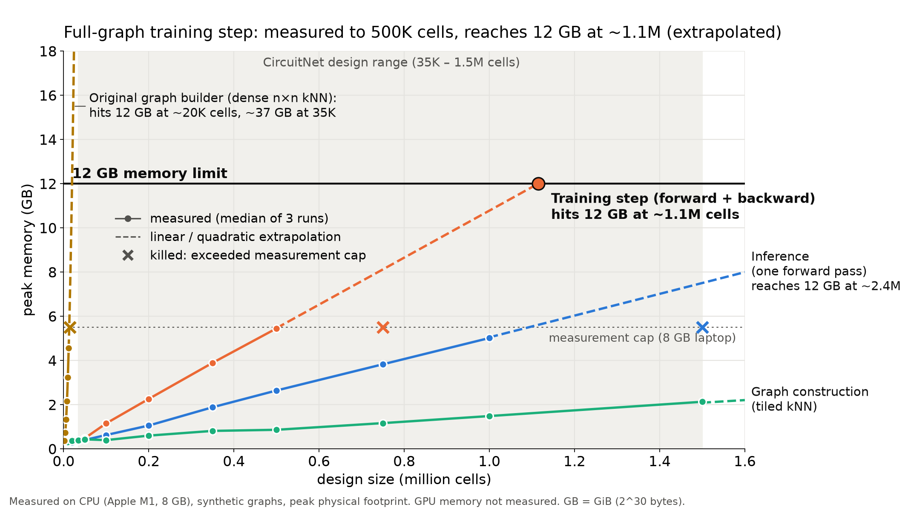

# Congestion prediction with a heterogeneous GNN

When a chip is laid out, every logic cell is first *placed*, and then the wires
connecting the cells are *routed* through a limited number of metal tracks.
**Routing congestion** is where the wiring demand in a region exceeds the tracks
available there. It is normally confirmed only after an expensive routing run.
This project predicts it *before* routing, from a placed but unrouted design,
using a heterogeneous graph neural network over three kinds of node: cells,
nets (the wires that connect cells), and spatial grid regions (GCells).

## Current status

- **Pipeline validated end to end on one small design.** The design is `gcd` in
  the open `nangate45` technology, about 606 cells after placement. All nine
  validation gates (Phases 0-8) passed: ground-truth extraction, inducing
  congestion, graph construction, grid alignment, a 45-sample mini-dataset,
  a single-sample overfit test, and a viewer.
- **The model reached Spearman 0.9702 (horizontal) / 0.9812 (vertical) on a
  single-sample overfit test.** That test checks whether the model can
  *memorise* one sample. It is a pipeline sanity check, not a measure of
  predictive accuracy.
- **The model has NOT been trained or evaluated on benchmark-scale data, and
  no generalisation result exists yet.**
- **Phases 9-13 (below) are scale engineering and infrastructure.** They run
  on *synthetic* graphs whose labels are an analytical proxy, not router
  output. None of their accuracy-like numbers say anything about how well
  the model predicts real congestion.
- The graphs and checkpoint from Phases 4-8 were lost. Re-running the
  overfit test or the viewer needs the ground truth regenerated with
  OpenROAD first (see [Setup](#setup-and-reproduction)).

Every number in this README is taken from the phase notes in
[`notes/`](notes/), which record how each was measured and what remains
unresolved.

## Results so far

### Pipeline validation on `gcd` / nangate45 (Phases 0-8)

| Phase | What was checked | Measured result |
|---|---|---|
| 1 | Baseline OpenROAD flow (via ORFS Docker) | 606 placed cells, 631 signal nets, 62.4% utilization after detailed placement |
| 2 | Per-GCell congestion extracted from OpenDB vs OpenROAD's own GUI heatmap | 144/144 GCells match, max absolute difference 0.000005 |
| 3 | Inducing real congestion (layer cap + routing blockage) | max combined congestion 1.6364 (baseline 0.7778); 186/289 GCells (64.4%) above 0.9 |
| 4 | Graph construction (6 relation types) | 0 isolated GCell nodes, 0 nets without pins |
| 5 | Cell-to-GCell assignment vs OpenROAD's `getXIdx`/`getYIdx` | 0 mismatches over 614 instances + 6 boundary cases; 606/606 cells inside their GCell |
| 6 | Mini-dataset: 3 blockage positions × 3 widths × 5 placement seeds | 45/45 samples built, 0 exact-duplicate congestion maps |
| 7 | Single-sample overfit test | Spearman 0.9702 / 0.9812 (both > 0.95 gate) |
| 8 | Streamlit viewer | re-prediction 26.8 ms |

**Model and loss.** The model, `CongestionGNN`, has 155,010 parameters. It uses
type-specific encoders, 3 layers of `HeteroConv` + `SAGEConv` over 6
relations, and a head that predicts [horizontal, vertical] congestion ratio
per GCell. It is trained with Huber loss plus a pairwise ranking loss.

**Two dead ends in the Phase 6 sweep.** The first two sweep designs (varying
layer-cap tier, then placement density) produced bit-identical congestion maps
across samples. The duplicate-map gate caught this before training, and the
sweep was redesigned around the one lever that measurably moved congestion
(routing blockages).

**Other samples.** On samples other than its training sample, the overfit
checkpoint gave Spearman of roughly 0.47-0.50. That is expected for a model
trained on one sample, and is not a generalisation result.

### Scale engineering on synthetic graphs (Phases 9-13)

No benchmark data (e.g. CircuitNet) and no OpenROAD were available for this
stage, and development ran on an 8 GB Apple M1 laptop, CPU only.

**Phase 9: synthetic generator.** `src/synthetic.py` generates CircuitNet-scale
graphs by running synthetic placements through the *same* `build_graph`
code as the real pipeline. It is parameterised by cell count; its structural
parameters are assumptions, not calibrated against CircuitNet. The largest
generated graph, 1.5M cells, has:
- 3,717,981 nodes and 32,175,356 edges
- a median net degree of 3, with the largest net at 150,085 pins
- a peak memory of 2150 MiB during construction



*The net degree distribution of the synthetic graphs at four sizes (35K-1.5M
cells), on log-log axes. Most nets have 2-4 pins, but a few "hub" nets (up to
150,085 pins at 1.5M cells) make naive batching of neighbourhoods
impractical.*

**Phase 12: analytical baselines.** `src/baselines.py` provides two reference
predictors with the same input and output as the GNN:
- **RUDY**, implemented from Spindler & Johannes, DATE 2007. It matches a
  brute-force evaluation of the paper's equations to within 1e-13.
- **A density-only predictor**, which uses no connectivity at all.

Both are implemented and tested, but **not evaluated against real ground
truth**. Their scores against the synthetic labels are not meaningful, and
RUDY's are circular, since the synthetic labels are themselves RUDY-like.

**Phase 13: training infrastructure.** Everything below was exercised end to
end in a short CPU run on synthetic data:
- TOML experiment configs
- train/val/test split by *design*, so no netlist appears in two splits
- checkpointing with resume
- gradient accumulation
- mixed precision that falls back to fp32 on CPU
- early stopping on validation Spearman
- a JSON-lines metrics log

A run of 3 epochs plus a resume to 6 finished with **bit-identical** weights
to an uninterrupted 6-epoch run. Getting there required fixing
multithreading nondeterminism: with 4 CPU threads, identical runs drifted
by up to 1.9e-4 in the weights after one epoch. Deterministic mode fixes
this at a ~45% cost in epoch time.

## Scalability finding

Phase 10 measured where the current approach breaks, using the synthetic
graphs. Peak memory is the process's physical footprint on CPU. Runs above
5.5 GiB were killed to protect the 8 GB machine, so everything beyond that
is **extrapolated from linear or quadratic fits, not measured**. GPU memory
was not measured.



*Peak memory versus design size (synthetic graphs) for full-graph training,
inference and graph construction. Solid lines are measurements (median of 3
runs); dashed lines are extrapolations. The original graph builder's
O(n²) kNN (left edge) fails almost immediately. A full-graph training step
reaches 12 GB at roughly 1.1M cells, an extrapolation from points measured
up to 500K cells.*

| Component | Measured | Largest that fits 12 GB |
|---|---|---|
| Original `build_graph` kNN (dense n×n) | 4.55 GiB at 12K cells; killed above 5.5 GiB at 15K | ~19,800 cells (extrapolated), below the smallest 35K-cell design |
| Original pairwise ranking loss (O(n²) over GCells) | 3.29 GiB at 6K GCells; killed at 8K | ~11,800 GCells (extrapolated); the 35K-cell synthetic design has 15,376 |
| Full-graph training step (forward + backward) | 5.45 GiB at 500K cells; killed at 750K | ~1.11M cells (extrapolated); 16.1 GiB predicted at 1.5M |
| Full-graph inference | 5.01 GiB at 1M cells; killed at 1.5M | ~2.4M cells (extrapolated) |
| Graph construction with the new tiled kNN | 2.13 GiB at 1.5M cells | not a bottleneck |

The two O(n²) components were replaced:
- The kNN became an exact tiled kNN, which matches the original's neighbour
  distances exactly.
- The ranking loss became a sampled-pairs version, with a relative difference
  of 5.2e-4 from the full loss in a test.

**Partition-based training (Phase 11).** `src/partition.py` makes training fit
a memory budget. It uses no random neighbour sampling; instead it:
1. Cuts the GCell grid into spatially contiguous rectangles with roughly
   equal cell counts.
2. Adds a 3-hop *halo* of surrounding nodes, one hop per layer of the
   3-layer model.
3. Caps high-fanout nets at 512 pins.
4. Chooses the number of partitions from a memory estimate fitted to the
   Phase 10 measurements.

| Design (synthetic) | Before: full-graph training step | After: largest partition |
|---|---|---|
| 500K cells | 5.45 GiB measured | 1.656 GiB measured (4 partitions) |
| 1.5M cells | killed above 5.5 GiB; 16.1 GiB extrapolated | 1.385 GiB measured (16 partitions, 2 GiB budget) |

The halo was checked against a full-graph reference at 1.5M cells. That
comparison used a randomly initialised model: no trained model exists at
this scale.
- **Halo, no degree cap:** all 656,100 GCell outputs are bit-identical to the
  full-graph computation.
- **Halo, 512-pin cap:** 64.2% of GCell outputs are bit-identical; the maximum
  error is 3.9e-7 against an output standard deviation of 0.082.
- **No halo:** none of the 9,684 boundary GCells match to within 1e-6.
- **Overhead:** the halo adds 13.5% more nodes in total.

How large the capping error is for a *trained* model is not yet measured.

## Repo structure

```
src/
  extract_congestion.py   ground truth: per-GCell demand/capacity from OpenROAD (runs under `openroad -python`)
  extract_placement.py    placed cells / nets / pins from an OpenROAD .odb (runs under `openroad -python`)
  build_graph.py          .npz -> PyG HeteroData (3 node types, 6 relations)
  build_dataset.py        builds and caches graphs for every Phase 6 sweep sample
  model.py                CongestionGNN (HeteroConv + SAGEConv)
  train.py                Phase 7 overfit test; config-driven trainer (Phase 13)
  metrics.py              Spearman, Kendall, congestion helpers
  synthetic.py            CircuitNet-scale synthetic graph generator + tiled kNN (Phase 9)
  memtrack.py             peak physical-memory measurement (macOS / Linux)
  scalability.py          memory/time measurement harness (Phase 10); scalability_report.py makes the table + chart
  partition.py            spatial partitioning with halos and degree capping (Phase 11)
  baselines.py            RUDY and density-only baselines (Phase 12)
  config.py, dataset.py   experiment configs; design-level splits and training units (Phase 13)
notes/                    one note per phase: what was built, how it was verified, measured results,
                          reproduction commands, open issues; figures/ and results/ hold the raw outputs
flow/                     OpenROAD-flow-scripts hooks: routing-layer cap, die blockage, Phase 6 sweep driver
app/viewer.py             Streamlit viewer: predicted vs ground-truth heatmaps, metrics, hotspot table
tests/                    gate scripts and tests for each phase
configs/                  TOML experiment configs
```

`data/raw/`, `data/processed/` and `runs/` are git-ignored and regenerable.

## Setup and reproduction

Python 3.11 with the pinned versions in [`requirements.txt`](requirements.txt).
PyTorch is the CPU build.

```bash
uv python install 3.11
uv venv --python 3.11 .venv
source .venv/bin/activate
uv pip install torch==2.9.1 --index-url https://download.pytorch.org/whl/cpu
uv pip install torch_geometric==2.8.0.post1 numpy==2.4.6 matplotlib==3.11.1 streamlit==1.62.0
```

**Model development needs no OpenROAD.** Everything in Phases 9-13 runs on
synthetic data, in this order:

```bash
python tests/test_synthetic.py        # generator + tiled kNN      (Phase 9)
python tests/test_partition.py        # partitioning + halo checks (Phase 11)
python tests/test_baselines.py        # RUDY + density baselines   (Phase 12)
python tests/test_train.py            # trainer: split, resume, AMP, early stopping (Phase 13)

python src/scalability.py prepare --cells 35000 100000 500000 1500000    # synthetic graphs
python src/scalability.py run --mode fwd_bwd --cells 35000 100000 500000 --stop-on-fail
python src/scalability.py report                                         # table + chart
python src/partition.py plan --cells 1500000 --budget-gib 2
python src/partition.py measure --cells 1500000
python src/train.py --config configs/synthetic_smoke.toml                # short training run
```

The exact commands behind every reported number, including all measurement
modes, are at the end of each phase note (`notes/phase9-*` to
`notes/phase13-*`).

**Regenerating ground truth needs OpenROAD**, via the OpenROAD-flow-scripts
(ORFS) Docker image `openroad/orfs`. This is only needed to rebuild the real
`gcd` dataset (Phases 1-6), and with it the Phase 7 overfit test and the
Phase 8 viewer:
1. Run the ORFS flow with the hooks in `flow/`, or the sweep driver
   `flow/sweep.sh`.
2. Extract with `openroad -python src/extract_congestion.py` and
   `src/extract_placement.py`.
3. Build graphs with `src/build_dataset.py`.
4. Run the overfit test: `python src/train.py <graph.pt> --save-checkpoint ...`.
5. Launch the viewer: `streamlit run app/viewer.py`.

These steps were originally run under WSL. Their full commands, with the
Docker mount patterns they need, are in `notes/phase1-*` to `notes/phase8-*`.

## Roadmap

- Scale up to CircuitNet 2.0: real benchmark designs and real
  global-routing ground truth, replacing the synthetic stand-ins.
- Baselines: evaluate the analytical baselines (RUDY, density-only) on real
  labels, and add a CNN baseline.
- A cross-technology-node transfer study.
- A paper.

## Attribution

This is an academic project that builds on published work, notably
[VeriHGN](https://arxiv.org/abs/2603.11075) (KDD 2026), a heterogeneous-graph
approach to congestion prediction. Its intended contribution is scoped as:
- transfer across technology nodes
- memory efficiency on commodity hardware
- ranking-first evaluation

Cross-technology-node transfer has not started. The memory-efficiency work
(Phases 10-11) and the ranking-based loss and early stopping (Phases 7, 13)
exist so far only on the `gcd` pilot and on synthetic data.
